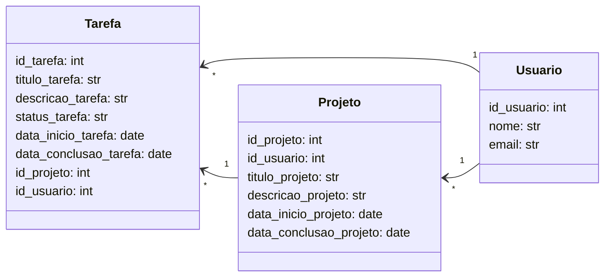

# next_tarefa

## Diagrama de Classes UML 

```mermaid
classDiagram
    direction RL
    class Usuario {
        id_usuario: int
        nome: str
        email: str
    }

    class Tarefa {
        id_tarefa: int
        titulo_tarefa: str
        descricao_tarefa: str
        status_tarefa: str
        data_inicio_tarefa: date
        data_conclusao_tarefa: date
        id_projeto: int
        id_usuario: int
    }

    class Projeto {
        id_projeto: int
        id_usuario: int
        titulo_projeto: str
        descricao_projeto: str
        data_inicio_projeto: date
        data_conclusao_projeto: date
    }
    
    Usuario "1" --> "*" Tarefa 
    Usuario "1" --> "*" Projeto 
    Projeto "1" --> "*" Tarefa 
    
```